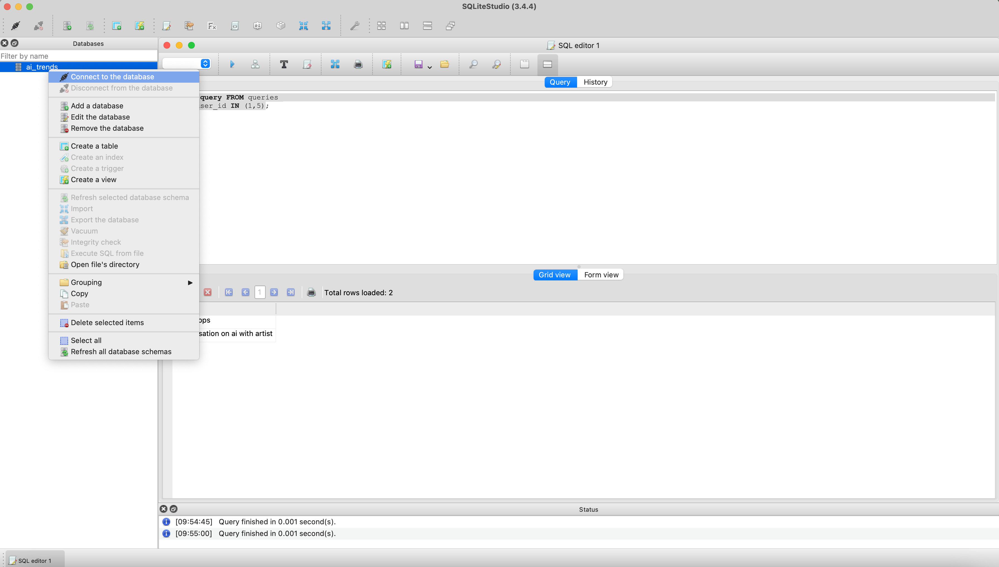
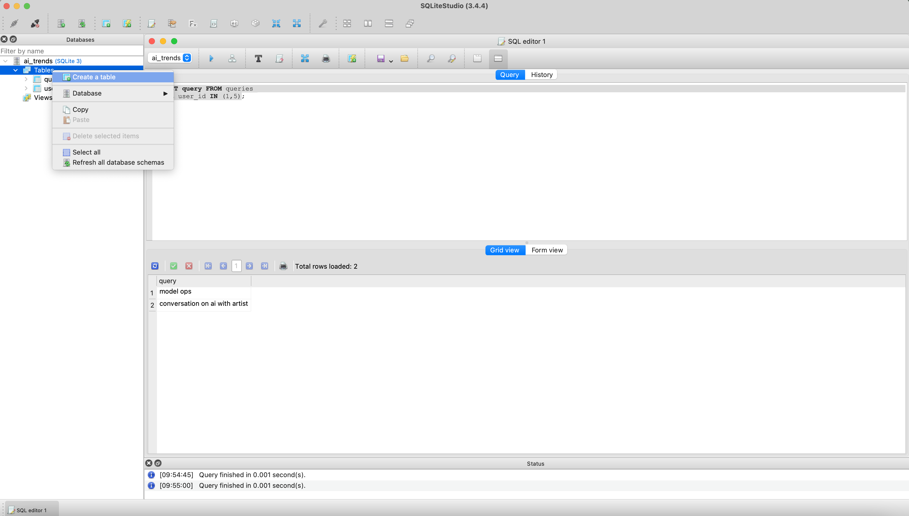

## Database
A SQLite3 database

### Getting started
The Binary for the DB is in the `resources` folder in  the root of the repository in the folder named `sqlite-tools-osx-x64-3440200`
#### Creating a database
```bash
/path/to/sqlite-tools-osx-x64-3440200/sqlite3 /path/to/db.sqlite
```
For example, the `ai_trends.db` database is created by running the following command:
```bash
cd /path/to/thisrepo/
./resources/sqlite-tools-osx-x64-3440200/sqlite3 ai_trends.db
```

#### Populating tables

##### GUI based Approach
You can download the [SQLite Studio application from here](!https://sqlitestudio.pl/)
1. Open the application, and add the DB to the application. 
2. Right Click the DB and click << Connect to the database >>

1. Once the DB is added, you can create tables by right-clicking the DB. Refer to the following screenshot.


The GUI gives you the ability to add data to the table as well. Select the table and click the `Data` tab.  
All utilities to add and save data are available in the tool bar.

##### CLI based Approach
You can use the command line to execute DDL and DML statements. For example, to create a table called `articles` 
1. Execute `./resources/sqlite-tools-osx-x64-3440200/sqlite3 ai_trends.db` this will start a command line interface with the following output
```bash
SQLite version 3.44.2 2023-11-24 11:41:44
Enter ".help" for usage hints.
sqlite> 
```
2. Execute the following DDL statement
```sql
CREATE TABLE articles (
    id INTEGER PRIMARY KEY AUTOINCREMENT,
    title TEXT NOT NULL,
    source TEXT NOT NULL,
    url TEXT NOT NULL,
    summary TEXT NOT NULL,
    content TEXT NOT NULL,
    created_at TEXT NOT NULL,
    updated_at TEXT NOT NULL
);
```
 